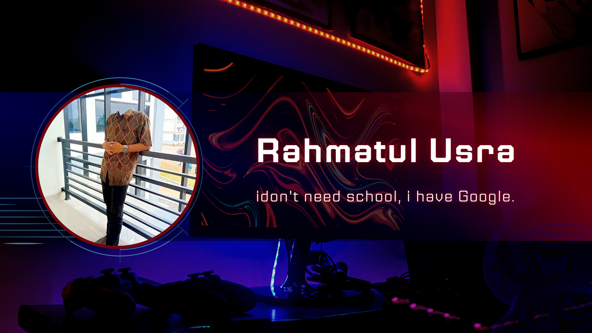

 

<h1 align="center">Hello, I'm Rahmatul Usra.</h1>
<h3 align="center">I don't need School, i have Google.</h3>

## 📊 My Github Stats

    

   
    
  
   
  <b>Note:</b> Top languages is only a metric of the languages my public code consists of and doesn't reflect experience or skill level.
 

## Connect with me:

 🌍  [Website Portofolio](http://xsrazy.github.io/)

## ❤ Views and Followers

